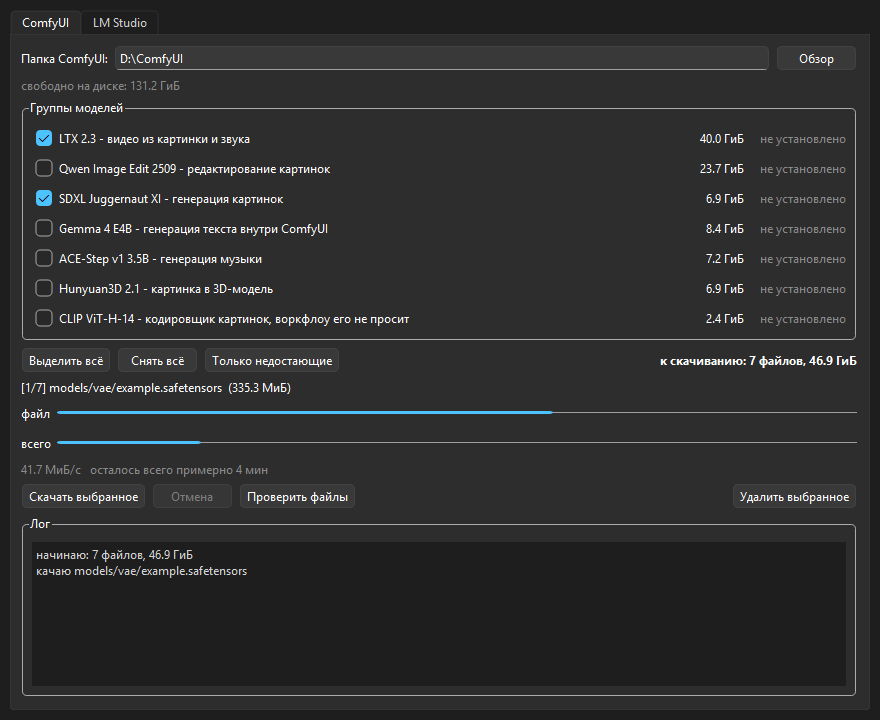
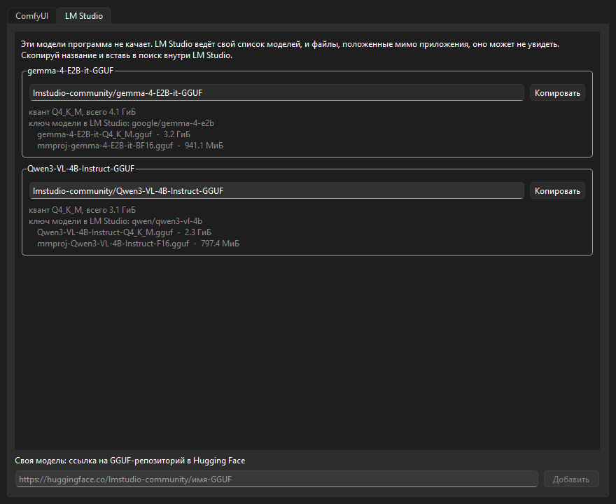

# InstallerModels

Программа возвращает модели ComfyUI обратно на диск, если ты их удалил, чтобы освободить место. Качает с Hugging Face, с докачкой после обрыва.

Для LM Studio скачивания нет. Там просто показываются точные названия, которые надо вбить в поиск внутри приложения.

В списке 15 файлов на 95.4 ГиБ для ComfyUI и 2 модели на 7.2 ГиБ для LM Studio.



## Что выбрать

| Вариант | Кому | Что нужно |
|---|---|---|
| `InstallerModels-Setup-1.0.5.exe` | обычная установка с ярлыками | ничего |
| `InstallerModels.exe` (portable) | запустить и забыть, без установки | ничего |
| `python install.py` | из консоли, скриптом | Python 3.8+ |

Готовые exe лежат в `dist/` после сборки, в git их нет. Как собрать - в [docs/build.md](docs/build.md).

### Установка

Запусти `InstallerModels-Setup-1.0.5.exe`. Ставится в папку пользователя (`%LOCALAPPDATA%\Programs\InstallerModels`), права администратора не нужны, UAC не выскочит. Создаёт ярлык в меню Пуск, запись в «Программы и компоненты» для нормального удаления и, если не снять галочку, ярлык на рабочем столе. Галочка снимается на странице выбора компонентов.

Установка поверх старой версии сначала сносит папку `_internal` целиком. PyInstaller меняет имена библиотек от сборки к сборке, и старые копирование новых файлов не перезаписывает: они просто остаются лежать рядом, а программа с ними не стартует.

### Portable

Просто запусти `InstallerModels.exe`. Ничего никуда не пишет, кроме самих моделей. Рядом с exe можно положить свой `models.json` - программа возьмёт его вместо встроенного.

Рядом лежат `README.md` и папка `docs` - те же, что в репозитории. До версии 1.0.5 клался один README, а ссылки из него вели в `docs/`, которой рядом не было: у человека с установленной программой половина ссылок открывала пустоту, а скриншоты не показывались вовсе.

## Как пользоваться окном

Сверху путь к ComfyUI. Если он определился неправильно, нажми «Обзор» и укажи нужную папку. Путь можно вписать и руками, в том числе через тильду: `~/ComfyUI` развернётся в домашнюю папку; набранный путь применяется по Enter. До версии 1.0.5 набранное в поле никуда не шло: строка менялась, а список групп оставался от прошлой папки, и запомнен такой путь тоже не был. Рядом видно, сколько свободно на диске; если диск отключили, там будет написано, что он не отвечает, а окно продолжит работать.

В списке групп галочками отмечаешь, что нужно. Справа от каждой строки написано, установлена группа, частично установлена или нет. Недокачанный или битый файл считается за «частично»: он на диске лежит, и его предстоит докачать, а не качать с нуля. Недокачанное лежит в соседнем файле `.part`, и статус смотрит именно на него. Раньше смотрели только на настоящее имя, а его файл получает лишь целиком: группа с двадцатью гигабайтами в `.part` показывалась как «не установлено». Кнопка «Только недостающие» отмечает всё, чего не хватает.

«Скачать выбранное» запускает загрузку. В окне подтверждения написан полный объём группы и отдельно то, что уже лежит недокачанным. Показываются две полосы: по текущему файлу и по всей очереди, плюс скорость и примерное время до конца. Обе цифры считают то, что уже на диске: полоса «всего» стартует с недокачанного, а время - только по тем байтам, которым ещё лететь по сети. До версии 1.0.4 в поток уходил один полный объём очереди, и после обрыва окно начинало полосу с нуля там, где на диске лежало почти всё, и обещало часы вместо минут. Файл, на котором вышла ошибка, полосу больше не заливает до конца: она останавливается на том, сколько успело лечь. «Отмена» останавливает, недокачанное сохраняется - в следующий раз продолжится с того же места. Если отмена пришла ровно на дописанном файле, он всё равно получит нормальное имя, а не останется `.part`.

«Проверить файлы» пересматривает диск и обновляет статусы. Полезно, если ты что-то удалил вручную.

Вкладка LM Studio - названия моделей с кнопкой «Копировать». Рядом с квантом показан ключ модели в LM Studio - тот, которым её зовут из `lms load` и из API. Он лежал в `models.json` и был расписан в документации, а сама программа его не показывала нигде. Скопированное теперь переживает закрытие окна: буфер обмена Tk отдаёт по запросу и только пока окно живо, так что до версии 1.0.5 «скопировал и закрыл» означало «вставлять нечего» - ровно тот порядок действий, на который кнопка и рассчитана.



## Из консоли

Нужен Python 3.8 или новее. Зависимостей нет, всё на стандартной библиотеке.

Посмотреть, что есть и что уже стоит:

```bash
python install.py --list
```

Поставить одну группу:

```bash
python install.py ltx
```

Несколько сразу:

```bash
python install.py qwen sdxl audio
```

Всё (95.4 ГиБ):

```bash
python install.py --all
```

Названия для LM Studio:

```bash
python install.py --lmstudio
```

Все команды:

| Команда | Что делает |
|---|---|
| `--list` | Список групп, размеры, что уже установлено |
| `--check [ГРУППА ...]` | Проверяет каждый файл: целый, недокачанный, битый или отсутствует. Без названий групп - все |
| `ГРУППА ...` | Ставит указанные группы |
| `--all` | Ставит всё |
| `--dry-run ГРУППА` | Показывает, что будет скачано, но не качает |
| `--lmstudio` | Названия моделей для LM Studio |
| `--root ПУТЬ` | Другая папка ComfyUI вместо той, что в `models.json` |

До версии 1.0.5 названия групп при `--check` игнорировались молча: `--check ltx` пересчитывал все 95 ГиБ, а `--check ltxx` с опечаткой - тоже все, и про опечатку не говорил никто. Теперь названия проверяются до разбора команды, одинаково для `--check` и для установки.

Код возврата 0 - всё хорошо, 1 - что-то не докачалось или не нашлось, 130 - прервали через Ctrl+C.

## Группы моделей

Группы собраны по сохранённым воркфлоу в ComfyUI, не наугад. Каждая группа - ровно те файлы, которые нужны одному воркфлоу.

| Группа | Размер | Что это | Воркфлоу |
|---|---|---|---|
| `ltx` | 40.0 ГиБ | LTX 2.3, видео из картинки и звука | `video_ltx2_3_ia2v.json` |
| `qwen` | 23.7 ГиБ | Qwen Image Edit 2509, редактирование картинок | `image_qwen_image_edit_2509.json` |
| `gemma` | 8.4 ГиБ | Gemma 4 E4B, генерация текста внутри ComfyUI | `llm_gemma4_text_gen.json` |
| `audio` | 7.2 ГиБ | ACE-Step v1 3.5B, генерация музыки | `audio_ace_step_1_t2a_song.json` |
| `sdxl` | 6.9 ГиБ | SDXL Juggernaut XI, генерация картинок | `Alex gen images.json` |
| `hunyuan3d` | 6.9 ГиБ | Hunyuan3D 2.1, картинка в 3D-меш | `3d_hunyuan3d-v2.1.json` |
| `clipvision` | 2.4 ГиБ | CLIP ViT-H-14 | ни один воркфлоу его не использует |

Полный список файлов с репозиториями и размерами - в [docs/models.md](docs/models.md).

## Как это работает

Файлы качаются напрямую по `https://huggingface.co/РЕПО/resolve/main/ПУТЬ`. Все репозитории из `models.json` открытые, токен для них не нужен.

Если добавить в `models.json` закрытый или «gated» репозиторий, Hugging Face ответит на него кодом 401 или 403. Программа увидит это и скажет прямо: репозиторий закрыт, прими лицензию на странице модели и положи токен в переменную окружения `HF_TOKEN`. Токен подхватывается автоматически - из `HF_TOKEN`, `HUGGING_FACE_HUB_TOKEN` или `HUGGINGFACE_TOKEN`, то есть из тех же переменных, что читает официальная `huggingface_hub`. Раньше 401 и 403 попадали в общую кучу с 404 и получали ответ «файл переехал, проверь путь в models.json» - то есть человека отправляли чинить строку, в которой всё было правильно.

Докачка. Файл пишется в `имя.safetensors.part` рядом с целевым. Если оборвалось, при следующем запуске программа видит недокачанный кусок и просит у сервера остаток через HTTP-заголовок `Range`. Проверяется, что сервер ответил кодом 206, а не 200 - иначе он проигнорировал запрос диапазона и качать надо с нуля. Это проверено на практике: файл, докачанный с середины, побайтово совпал с оригиналом по sha256.

Проверка размера. У каждого файла в `models.json` записан точный размер в байтах, снятый с Hugging Face. Он сверяется дважды.

Первый раз - по заголовку ответа, до того как на диск попадёт хоть один байт. При обычном запросе это `Content-Length`, при докачке - число после дробной черты в `Content-Range`. Если сервер называет не тот размер, значит `models.json` устарел, и качать нечего: программа сразу пишет оба числа в байтах. Именно в байтах, а не в гигабайтах - расхождение бывает в четыре байта, и в округлённом виде обе половины сообщения выглядели одинаково, хотя весь его смысл в том, чтобы назвать правильное число для `models.json`. Раньше расхождение вылезало только в самом конце, и цикл повторов успевал скачать файл трижды. На файле в 27 ГиБ это около 81 ГиБ трафика ради одного неверного числа.

Нулевой размер в заголовке приговором не считается. Пустой `Content-Length` сервер отдаёт и когда сбой у него самого, так что о `models.json` это не говорит ничего: такой ответ уходит в обычный повтор. Раньше случайная пустая отдача объявлялась устаревшим манифестом, скачивание останавливалось насовсем, и чинить предлагалось файл, с которым всё было в порядке.

Второй раз - после скачивания, и только потом `.part` переименовывается в настоящее имя. Если размер не сошёлся, файл остаётся `.part` и программа пишет об ошибке. Из-за этого в папке моделей никогда не появится файл с правильным именем и битым содержимым.

Уже установленное пропускается. Смотрится размер файла на диске, и если он совпадает с ожидаемым, файл не трогается.

Обрывы связи. Пять неудач **подряд** на файл, пауза 5 секунд между попытками. Каждая попытка продолжает с того места, где остановилась предыдущая. Слово «подряд» тут главное: как только очередная попытка дописала в файл хоть один новый байт, счётчик обнуляется, и качать можно сколько угодно долго. Обрывов на тридцати гигабайтах бывает под сотню, и это нормально - лишь бы файл двигался вперёд.

До версии 1.0.3 пять попыток считались на весь файл целиком. Пятый обрыв убивал закачку, даже если каждый из них честно дописывал очередной кусок: файл рос, а программа сдавалась. На большой модели по дрожащей связи докачаться было нельзя в принципе - только запускать заново и надеяться проскочить.

Сравнивается при этом не с прошлым размером, а с самым большим, который вообще видели. Иначе перезапуск с нуля (когда сервер отказал в докачке и файл обнуляется) каждый раз выглядел бы прогрессом, счётчик обнулялся бы вечно, и программа крутила бы этот круг без конца. Сервер, который отвечает, но не присылает ни байта, по-прежнему исчерпывает все пять подходов и честно сдаётся.

Перезапуски с нуля считаются отдельно, и их тоже пять. Одной планки «самого большого размера» не хватало: она обнуляется вместе с файлом, а значит при каждом перезапуске счётчик обрывов начинал с чистого листа. Сервер, который не умеет `Range` и вдобавок рвёт связь, попадал в круг, из которого не было выхода: скачал кусок, оборвался, начал заново, скачал тот же кусок. До версии 1.0.4 из этого круга можно было выйти только «Отменой» в окне или Ctrl+C в консоли - программа не сдавалась и не двигалась. Теперь после пятого перезапуска она останавливается и пишет, что сервер каждый раз шлёт файл с начала.

Недокачанный `.part` не стирается никогда, даже если попытки кончились впустую: следующий запуск продолжит с того же байта. Раньше ответ без единого нового байта считался поводом начать файл заново, и на двадцати гигабайтах один сбойный ответ выкидывал часы работы. Если один файл в итоге не скачался, остальные всё равно качаются, а в конце показывается список неудачных. Просто запусти ещё раз.

Кусок больше ожидаемого не стирается сразу. Докачать его нельзя, но и удалять вслепую нечего: если ошибка в `models.json`, а не в файле, то под удаление попадёт как раз целый файл - и следующая же строчка сообщит, что размер в манифесте неверный. Сначала спрашивается сервер, и лишнее обрезается только после того, как он подтвердит свой размер.

Замолчавший сервер обрывается по таймауту. Соединение живо, а байт из него нет и не будет: такое ловит таймаут сокета в 60 секунд, и молчание дольше него приходит обычным сбоем связи, то есть уходит в те же повторы. Отсчёт идёт от каждого чтения, а не от всей закачки, и это принципиально: файл на 30 ГиБ по медленной связи идёт часами, и ограничивать его целиком нельзя. Обратная сторона у этого одна, и она честно названа в [docs/tests.md](docs/tests.md): сервер, который капает по байту раз в полминуты, заводит таймаут заново каждым байтом и не обрывается никогда. Отличить его от просто медленной связи нечем.

Не всякий обрыв приходит как ошибка сети. Бывает, что сервер закрывает соединение молча, и чтение просто заканчивается раньше времени. Такой случай тоже считается обрывом: в лог пишется, на скольких байтах поток кончился, и причина попадает в итоговое сообщение.

Ошибка 404 не ретраится. Если файл в репозитории переименовали, программа падает сразу с понятным сообщением, а не ждёт пять попыток впустую. Так же ведут себя 401 и 403, только сообщение у них другое - про лицензию и токен.

Ошибка записи на диск не считается обрывом связи. `open()` отдаёт тот же `OSError`, что и сокет, и до версии 1.0.4 папка только для чтения или занятое имя уходили в общий цикл: двадцать секунд повторов, а в конце жалоба на связь, которая была в порядке. Файл теперь открывается до сетевой части, и такая ошибка называется своим именем сразу - вместе с путём, на котором споткнулись.

Помехи на диске выясняются до сети. Папка с именем нужного файла, файл на месте папки `models`, том, на котором нельзя создать папку, - каждое из этого до версии 1.0.5 всплывало последней строкой скачивания, сырым `OSError` и уже после того, как все гигабайты выкачаны впустую. Папку с именем файла программа при этом показывала как «битый файл»: `exists()` отвечает «да» и на папку, а лежащий рядом `.part` не замечался вовсе. Теперь программа сначала смотрит, во что вообще собирается писать, и в таком случае в сеть не ходит совсем.

Занятый файл не съедает скачанное. Переименование `.part` в настоящее имя - единственное место, где программа трогает файл под его нормальным именем, и до версии 1.0.5 оно было ничем не прикрыто. Windows не даёт переименовать поверх файла, который кто-то держит открытым, а держит его обычно запущенный ComfyUI: тридцать скачанных гигабайт кончались строкой `[WinError 5] Отказано в доступе` без единого слова о том, что закрывать, и со стороны это выглядело как «скачалось и пропало». Теперь сообщение прямо называет виновника, а файл остаётся целым в `.part`: закрыл ComfyUI, запустил ещё раз - и он встаёт на место, не взяв из сети ни байта.

Сжатие на лету запрещено явно, заголовком `Accept-Encoding: identity`. Это не вежливость: сожми прокси ответ на лету - и `Content-Length` станет размером архива, а не файла. Программа объявила бы `models.json` устаревшим и назвала бы «правильный» размер, которого не существует, а докачка по `Range` поехала бы по чужим смещениям.

Кончившееся место на диске тоже не ретраится. Оно прилетает тем же `OSError`, что и обрыв сокета, и до версии 1.0.3 уходило в общий цикл повторов: пять подходов по пять секунд, а в конце жалоба на сеть. Места от этого не появлялось, зато диагноз уводил искать проблему совсем не там. Теперь программа сразу говорит, что диск полон.

Место на диске проверяется перед началом, под всю очередь целиком - но с вычетом того, что уже лежит в `.part`. Эти байты на диске уже есть и второй раз места не просят. Раньше прерванная на середине группа в 40 ГиБ отказывалась продолжаться, пока не освободишь все 40 ГиБ ещё раз.

Одна и та же группа, названная дважды, считается за одну. `python install.py ltx ltx` скачает пять файлов, а не десять.

`models.json` проверяется целиком при чтении, а не по частям и не по месту. Раньше смотрели только на `dest`, а всё остальное разбиралось там, где понадобится: запись без `dest` давала `KeyError`, `groups` в виде списка - `AttributeError`, а размер, записанный строкой, вообще ничего не давал и всплывал уже сложением размеров в окне. Ни одно из трёх не ловилось обработчиком в `install.py`, и человек, который этот же файл руками и правил, получал трассировку Python вместо строчки о том, что не так. Теперь любая кривизна - отсутствующее поле, не тот тип, пустая группа, ноль или строка вместо размера - всплывает одним понятным сообщением с указанием группы и файла. Та же проверка стоит и в `build.py`, так что своей копии, которая успевает отстать, больше нет.

Поле `dest` проверяется там же. Путь обязан быть относительным, без `..` и без буквы диска. Причина простая: в Python `Path("C:/ComfyUI") / "C:/qwe.bin"` - это просто `C:/qwe.bin`, папка ComfyUI выбрасывается целиком. Одна опечатка в `dest` - и файл на 30 ГиБ уезжал куда-то мимо, молча и без единого предупреждения. Теперь такая строка отвергается сразу при загрузке манифеста, а `build.py` не даёт ей уехать внутрь собранного exe.

Там же отсеиваются имена, которые Windows принимает, но хранит не так, как написано. `models/CON.bin` - это консоль, а не файл: запись уходит в никуда и не жалуется, на диске потом ничего нет, и файл на 30 ГиБ качается заново каждый запуск - без ошибки, без файла и без единой зацепки. Хвостовые пробелы и точки Windows молча срезает, файл ложится под другим именем, и проверка статуса его уже не находит. Запрещены `CON`, `PRN`, `AUX`, `NUL`, `COM1`-`COM9` и `LPT1`-`LPT9` с любым расширением, хвостовой пробел или точка и знаки `< > : " | ? *`. Придирка не на будущее: править `models.json` руками этот README зовёт прямо.

## Путь к ComfyUI

По умолчанию берётся из `models.json`, поле `comfyui_root`:

```
C:/Users/User/Documents/ComfyUI
```

В окне путь можно поменять кнопкой «Обзор». Выбранная папка запоминается в `%LOCALAPPDATA%\InstallerModels\settings.json` и подставляется при следующем запуске. До версии 1.0.3 выбор жил ровно до закрытия окна, и папку приходилось искать заново каждый раз - при том что путь из `models.json` почти никому не подходит. Деинсталлятор этот файл удаляет вместе с программой.

В консоли:

```bash
python install.py --all --root "D:/ComfyUI"
```

```bash
set COMFYUI_ROOT=D:/ComfyUI
python install.py --all
```

Порядок такой: `--root`, потом `COMFYUI_ROOT`, потом папка, выбранная «Обзором», потом `models.json`. Один и тот же порядок у окна и у консоли. До версии 1.0.4 выбранную папку знало только окно, а `install.py` каждый раз начинал с пути из `models.json`: выберешь папку мышкой, запустишь `--check` в консоли - и она пересчитывает совсем другую папку, честно сообщая, что ничего не установлено.

## LM Studio

Скачивание LM Studio программа не делает специально. Если положить файлы в папку мимо приложения, оно может их не подхватить, пока не переиндексирует. Надёжнее скачать через само LM Studio.

| Что вбить в поиск | Квант | Размер |
|---|---|---|
| `lmstudio-community/gemma-4-E2B-it-GGUF` | Q4_K_M | 4.1 ГиБ |
| `lmstudio-community/Qwen3-VL-4B-Instruct-GGUF` | Q4_K_M | 3.1 ГиБ |

Обе модели с картинками на входе, поэтому к каждой идёт свой `mmproj`-файл. LM Studio подтянет его сам.

Через консоль, если установлен `lms`:

```bash
lms get lmstudio-community/gemma-4-E2B-it-GGUF
```

Подробности с именами файлов - в [docs/lmstudio.md](docs/lmstudio.md).

## Устройство проекта

| Файл | Зачем |
|---|---|
| `models.json` | Список моделей: куда класть, откуда качать, сколько весит |
| `core.py` | Скачивание, докачка, проверка размеров. Общий для окна и консоли |
| `gui.py` | Окно на tkinter |
| `install.py` | Консольный вариант |
| `build.py` | Сборка portable exe и установщика |
| `setup.nsi` | Скрипт установщика для NSIS |
| `tests.py` | Проверки на всё, что уже ломалось. Гоняются перед каждой сборкой |
| `tests_matrix.py` | Перебор пространства состояний с проверкой инвариантов |
| `docs/` | Сборка, полный список моделей, LM Studio. Едет в поставку рядом с exe |

Окно и консоль пользуются одним `core.py`, поэтому логика скачивания у них не может разойтись.

`tests.py` запускается сам по себе - `python tests.py` - и не требует ни сети, ни сторонних библиотек: Hugging Face в нём изображает локальный сервер, которому можно велеть рвать соединение, отдавать не тот размер или молчать в ответ.

Проверок две пачки, и устроены они противоположно. В `tests.py` - список поломок, которые уже случались: каждая написана после того, как баг нашёлся, и названа так, чтобы из отчёта было понятно, что именно сломалось. Такие проверки по построению ловят баг только во второй раз.

В `tests_matrix.py` - наоборот: он не знает ни одного конкретного бага. Он перебирает 480 сочетаний того, как может повести себя сервер и что может лежать на диске, и в каждой клетке требует одних и тех же семи правил - вроде «наружу вылетает только понятная ошибка, а не трассировка Python» и «под настоящим именем никогда не появляется неправильное содержимое». Такие правила ловят и то, чего никто не предвидел. Там же перебираются 1884 очереди для полосок окна и 264 способа испортить манифест.

Всего 40 проверок, за четырьмя из них 2640 порождённых, весь прогон - пять секунд. Проверками накрыты и консоль (коды возврата, разбор команды, установка от начала до конца), и окно (сборка виджетов, насос событий, три исхода закачки), и сама сборка, и `setup.nsi`.

Подробно про инварианты, оси перебора и мутационный прогон - в [docs/tests.md](docs/tests.md).

## Если поменялся состав моделей

Программа ничего не угадывает, она читает `models.json`. Чтобы добавить модель, допиши в нужную группу запись:

```json
{
  "dest": "models/loras/моя-lora.safetensors",
  "repo": "автор/репозиторий",
  "path": "путь/внутри/репозитория.safetensors",
  "size": 123456789
}
```

Размер в байтах узнаётся так:

```bash
curl -sIL "https://huggingface.co/автор/репозиторий/resolve/main/путь.safetensors" | grep -i x-linked-size
```

Именно `x-linked-size`, а не `content-length`. Большие файлы на Hugging Face лежат в LFS, и `content-length` показывает размер редиректа, а не самого файла.

Для portable-версии положи изменённый `models.json` рядом с exe - он перебьёт встроенный.

## Известные ограничения

Качается по одному файлу за раз, в один поток. На 95 ГиБ это долго. Параллельная качалка была бы быстрее, но потребовала бы зависимостей, а смысл в том, чтобы всё работало на голом Python.

Проверяется только размер, не контрольная сумма. Hugging Face не отдаёт sha256 обычным запросом, а считать хеш от 95 ГиБ на каждой проверке долго. Совпадение размера байт в байт отсекает всё, что реально ломается: оборванную закачку, пустой файл, не тот квант.

Ветка всегда `main`. Если автор репозитория удалит или переименует файл, скачивание упадёт с 404. Тогда надо зайти на страницу репозитория и поправить `path` в `models.json`.

Установщик и деинсталлятор отказываются работать, пока окно программы открыто. Ищут они его по заголовку окна через `FindWindow`.

Заголовок, имя программы и версия записаны ровно один раз - в `core.py`. До версии 1.0.5 версия жила в трёх местах (`build.py`, `!define` в `setup.nsi` и команда в его же шапке), заголовок окна в двух, имя программы в трёх. За тем, чтобы копии не разъехались, следили четыре отдельные проверки, и каждая из них появилась после того, как копии таки разъехались. NSIS читать Python не умеет, поэтому `build.py` кладёт рядом с `setup.nsi` порождённый `version.nsh` с теми же тремя строками, а `setup.nsi` его подключает. Проверка вида «A совпадает с B» - это симптом: один и тот же факт записан дважды. Сверять копии дешевле не становится, дешевле их не заводить.

Установка поверх старой версии перезаписывает `models.json` в папке программы. Список моделей - часть поставки, и новая версия приносит свой. Если ты правил его руками, сохрани копию: путь к ComfyUI при этом не теряется, он лежит отдельно, в `settings.json`. Деинсталлятор сносит папку установки целиком - с версии 1.0.4 не по списку имён, а полностью, убедившись сперва, что это действительно папка программы. Список имён отставал от того, что кладёт PyInstaller, а `RMDir` без `/r` на непустой папке молча ничего не делает: огрызок оставался лежать после «удалено».

Папку установки на странице выбора можно поменять, и до версии 1.0.5 поменять её было можно на любую - хоть на рабочий стол, хоть на папку с документами. Файлы легли бы туда поверх чужих, а деинсталлятор потом сносит папку установки целиком, вместе со всем, что в ней окажется. Теперь установщик пускает только в пустую папку или в свою же, от прошлой версии, и на чужой непустой папке отказывается идти дальше.

Удаление моделей программа не делает. Это сделано специально: удалять 95 ГиБ должен человек руками, а программа нужна, чтобы вернуть их обратно.
